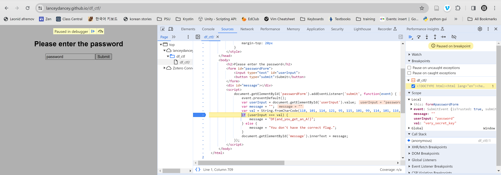

# Setup
Created an image of user\_drive with no partitions using FTK Imager 4.7.1
then loaded image into evidence tree.

# Looking through Recycle Bin:
`$RNFG3Q3.docx` was the only DOCX that seemed properly formatted. Exported and opened, it said:
"I've been thinking abuot hiding my passwords in plain sight. I learned about this thing called
steghide. Maybe ill use it on  one of my photos".

# Looking on Desktop:
Only thing was `the_secret_key.xlsx` which is password protected.

# Looking in Pictures > iCloud Photos:
## FAB.jpeg
```
 $ steghide info FAB.jpeg
"FAB.jpeg":
  format: jpeg
  capacity: 43.2 KB
Try to get information about embedded data ? (y/n) y
Enter passphrase:
  embedded file "b64_password.jpg":
    size: 10.8 KB
    encrypted: rijndael-128, cbc
    compressed: yes

 $ steghide extract -sf FAB.jpeg
Enter passphrase:
wrote extracted data to "b64_password.jpg".
```

When I opened `b64_password.jpg` it was an image of the text `cHJldHR5Z3JlYXRwYXNzd29yZA==`
```
 $ echo "cHJldHR5Z3JlYXRwYXNzd29yZA==" | base64 --decode
prettygreatpassword
```

I tried to use it on the other images but it didn't seem to be working. I tried in on 
`the_secret_key.xlsx` and it worked. 

### the\_secret\_key.xlsx
| The key |
| ------- |
| very\_secret\_key |

- `IMG_8397.jpeg`
- `IMG_8398.jpeg`
- `IMG_8399.jpeg`
- `IMG_8400.jpeg`
- `IMG_8401.jpeg`

# Looking through Edge history
Edge history is found in `Users\User\AppData\Local\Microsoft\Edge\User Data\Default\History`

```
 $ sqlite3 History
 sqlite> SELECT * FROM urls;
1|file:///C:/Windows/system32/oobe/FirstLogonAnim.html||1|0|13355352995494526|0
2|https://go.microsoft.com/fwlink/?linkid=2132465&form=MT004A&OCID=MT004A|Welcome to Microsoft Edge|2|1|13355353984776401|0
3|https://www.microsoft.com/edge/welcome?form=MT00LJ|Welcome to Microsoft Edge|2|0|13355353984776401|0
4|https://www.microsoft.com/en-us/edge/welcome?ep=296&es=66&form=MT00LJ|Welcome to Microsoft Edge|3|0|13355353985321551|0
5|https://lanceydancey.github.io/df_ctf/|CTF Challenge|1|1|13355354004274338|0
```

The only interesting URL was `lanceydancey.github.io/df_ctf/` so I went there. It asked for a 
password. I looked through the developer console and was able to see the check against the
input so that I could input it. 



The output with the correct password was `DF{and_you_get_an_A!}`. 


