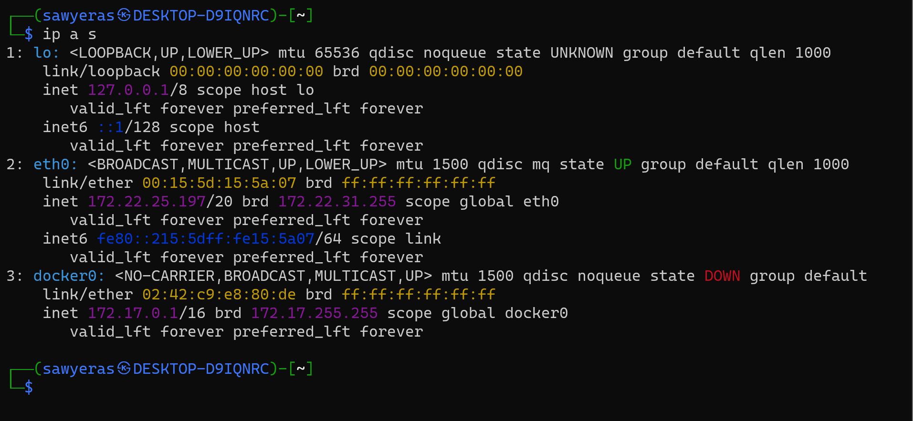
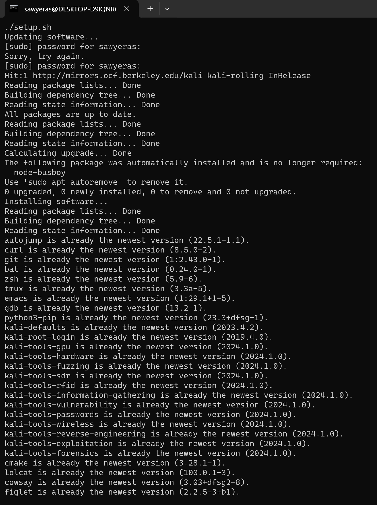

# HW1 - VM Setup

## Initial Setup
I used WSL to set up the VM. First I installed it with:

```powershell
> wsl --install -d kali-linux
```

Then I installed a GUI incase I might want it for future use and ran it to ensure that it
worked:

```powershell
> sudo apt update
> sudo apt upgrade
> sudo apt install -y kali-win-kex
> kex --win -s
```



## System Config
Since the system was up to date I just downloaded the provided script and ran it. 

```bash
$ curl -LO https://raw.githubusercontent.com/dkmcgrath/courses/main/netsec/setup.sh
$ chmod +x setup.sh
$ ./setup.sh
```


