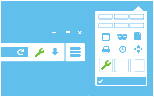

# Summary


# Purpose
This investigation's purpose was to examine Jenny Card's thumb drive for evidence linking
her with the sale of fraudulent gift cards from several retail stores in Chicago.

# Methodology
I started by using `kpartx` and `mount` to mount the image of the thumb drive. 

```
 $ sudo kpartx -av fsf.dd
add map loop0p1 (252:0): 0 409600 linear 7:0 40
add map loop0p2 (252:1): 0 15538176 linear 7:0 411648

 $ sudo mount -t ntfs-3g -o ro,noexec /dev/mapper/loop0p2 ~/fsf
```

The drive appeared to be empty, but there was still binary data that could be sifted through
to find the files. 

I started by looking for JPEG data. Each JPEG file starts with `ffd8 ffe0` and ends with 
`ffd9`. Using this I was able to find the addresses of the start and end of the JPEG file
and carve it out manually using `dd`. `dd` requires that the offsets and sizes are done in 
decimal rather than hexadecimal, so the value for `skip` is 0x16ffd90 in decimal, and the 
value for `count` is 0x17b200a - 0x16ffd90 in decimal.

```
 $ xxd fsf.dd | grep "ffd8 ffe0"
0167f000: ffd8 ffe0 0010 4a46 4946 0001 0100 0001  ......JFIF......
0187e000: ffd8 ffe0 0010 4a46 4946 0001 0100 0001  ......JFIF......
...

 $ xxd -s 0x0167f000 fsf.dd | grep ffd9
016ffd90: 0000 0000 0000 0000 0000 0000 0000 0000  ................
017b2000: bbdc 7b35 7c28 2268 ffd9 bd38 51ae 8857  ..{5|("h...8Q..W
...

 $ dd if=fsf.dd of=image.jpg skip=23588864 bs=1 count=1257482
1257482+0 records in
1257482+0 records out
1257482 bytes (1.3 MB, 1.2 MiB) copied, 1.28559 s, 978 kB/s
```

The output image:


To save on time I continued using file carving tools rather than carving manually. 
The first tool that I used was `foremost` which I used to search for JPEGs, GIFs, and PDFs. 

```
 $ foremost -T -t jpg,gif,pdf -i fsf.dd
Processing: fsf.dd
|******************************************************************************|

 $ cat output_Mon_Feb_19_15_36_54_2024/audit.txt
Foremost version 1.5.7 by Jesse Kornblum, Kris Kendall, and Nick Mikus
Audit File

Foremost started at Mon Feb 19 15:36:54 2024
Invocation: foremost -T -t jpg,gif,pdf -i fsf.dd
Output directory: /home/user/output_Mon_Feb_19_15_36_54_2024
Configuration file: /etc/foremost.conf
------------------------------------------------------------------
File: fsf.dd
Start: Mon Feb 19 15:36:54 2024
Length: 7 GB (8166703104 bytes)

...

341 FILES EXTRACTED

jpg:= 204
gif:= 137
```

On inspection, the GIFs were either single white pixels or various emojis and stickers and I 
deemed them irrelevant. 

The other file carving tool that I used was `photorec` which has a text-based interface to 
select the options.

```
 $ photorec fsf.dd
 > [Proceed]
 > 2 P MS Data
 > [Search]
 > [Other	] FAT/NTFS/HFS+/ReiserFS/...
 > [	Free	] Scan for file from NTFS unallocated space only
PhotoRec 7.1, Data Recovery Utility, July 2019
Christophe GRENIER <grenier@cgsecurity.org>
https://www.cgsecurity.org

Disk fsf.dd - 8166 MB / 7788 MiB (RO)
     Partition                  Start        End    Size in sectors
 2 P MS Data                 25 159  7   992 211 51   15538176 [Untitled] [Untitled]


32 files saved in /home/sawyeras/photorec-out/recup_dir directory.
Recovery completed. 
```

Unfortunately none of the files recovered by `photorec` were relevant to the investigation.

The JPEGs recovered using `foremost` were of the most interest to the investigation so I 
continued by examining them. Some of the photos had GPS data.

```
 $ exiftool output_Sun*/jpg/*.jpg | grep "GPS Position"
GPS Position                    : 41 deg 50' 57.30" N, 87 deg 57' 14.13" W
GPS Position                    : 41 deg 50' 57.59" N, 87 deg 57' 17.21" W
...
```

As such, I decided to write a Python script (`plot.py`) to plot the coordinates. 
It expects a directory of images to be provided and parses the exif data and plots
any present GPS data. It uses Pillow to extract and parse the exif data and Folium to plot 
it and generate an HTML file (`index.html`) to display it. 

```
Basic Usage:
 python3 plot.py [baseDirectory]

'baseDirectory' is an option argument, if left blank the script will use 
the current working directory. When specifying a directory, don't forget 
the trailing '\'
```

# Findings
All of the images with GPS data were taken in the Oakbrook shopping center in Chicago. 
They were either photos of the outside of various stores or photos of the gift cards offered
in the given location. 

There were also many photos of single gift cards or e-gift cards:
- 00149432.jpg
- 00149488.jpg
- 00149504.jpg
- 00149536.jpg
- 00149560.jpg
- 00149616.jpg
- 00149640.jpg
- 00149680.jpg
- 00149696.jpg
- 00149720.jpg
- 00149776.jpg
- 00149792.jpg
- 00149960.jpg
- 00149976.jpg
- 00149992.jpg
- 00150016.jpg
- 00150168.jpg
- 00150192.jpg
- 00150208.jpg
- 00150232.jpg
- 00150352.jpg
- 00150376.jpg

Some photos were images of gift cards that could be gotten off the internet:
- 00149592.jpg 
- 00150120.jpg
- 00150328.jpg 

# Conclusions


